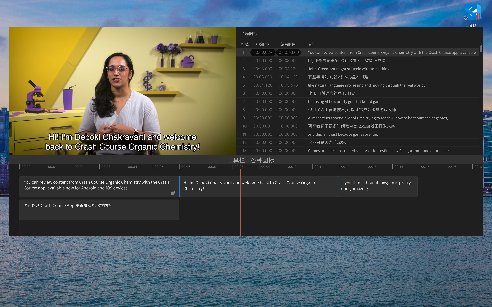
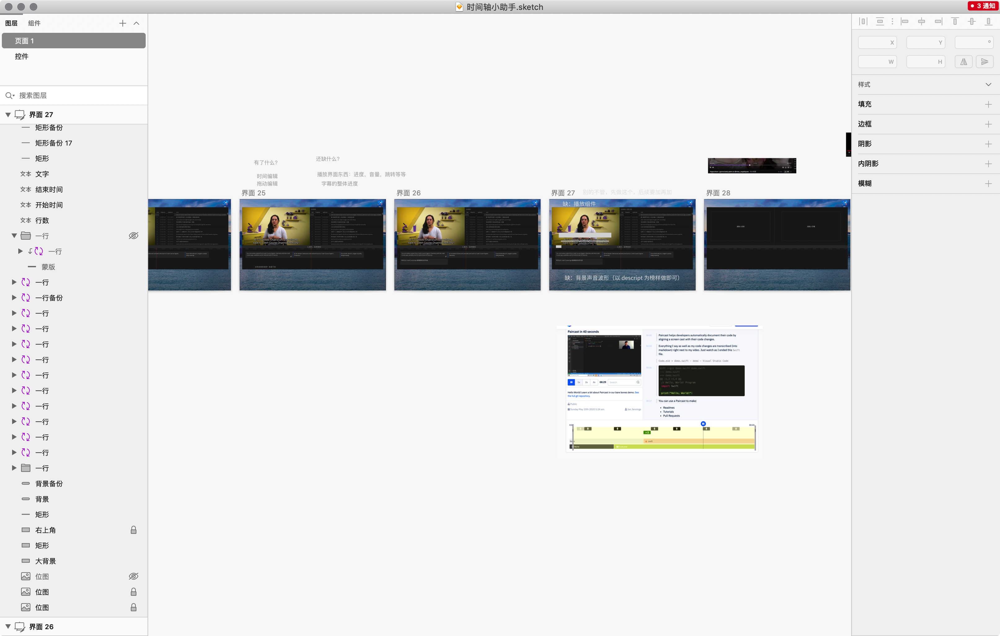
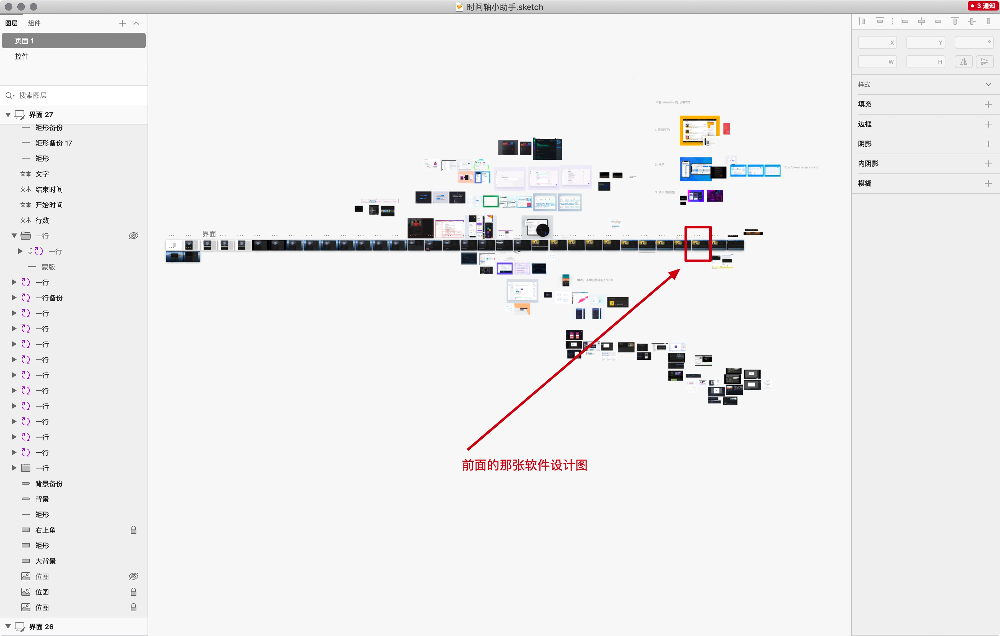
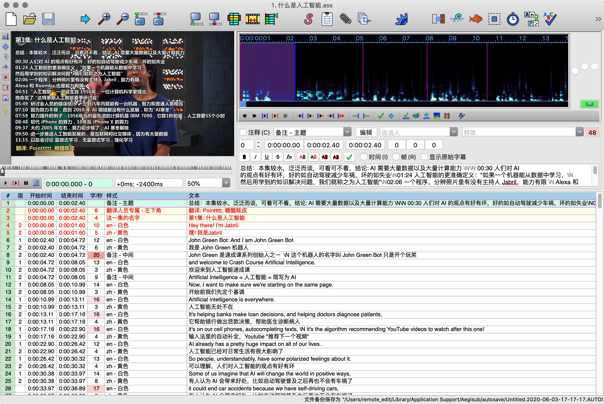
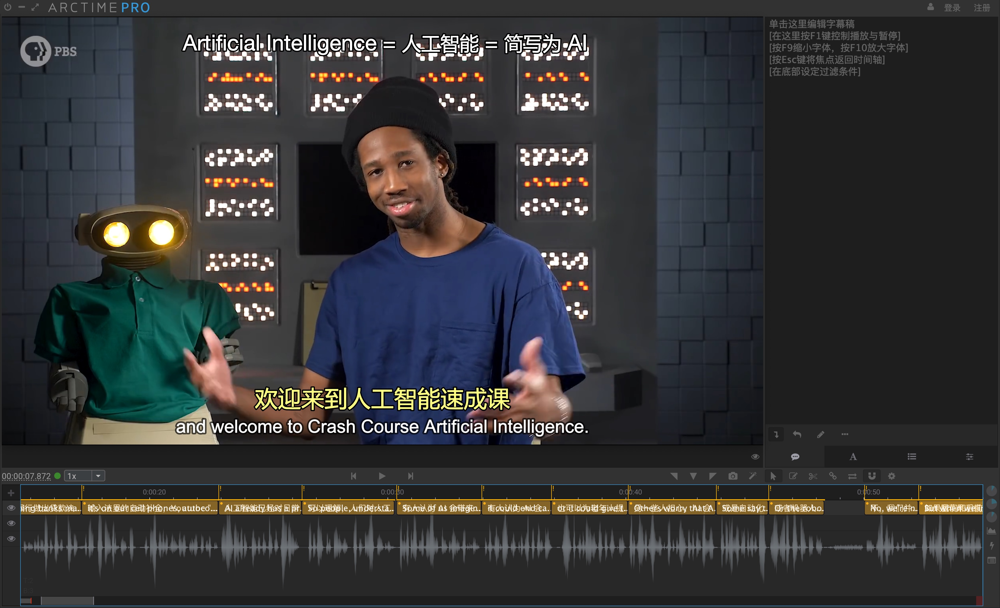
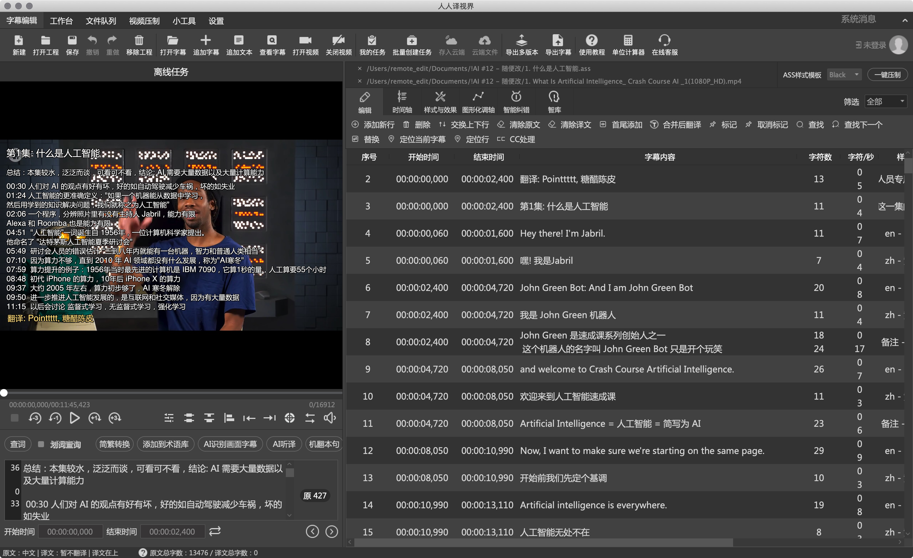

## 产品名：时间轴小助手 （macOS 独占, 不支持 Windows)
[README in English](./README-in-English.md)

## 设计图 
    

这个设计图仅供参考，最终成品可能有差异。   
这是目前的目标，先做到这个再说，   
实际开发中可能会微调，但大体不变：
一个视频播放区域，一个时间轴区域，一个表格区域。     

## 当前状态：开发中
第一版预计完成时间：2020年下半年。       

备注：我2020年11月上旬有一场考试，这是今年唯一一场。     
因此，9月和10月我需要花很多时间学习来准备考试。    
导致开发会慢一些。    
如果2020年下半年不能做出来（也就是2021年1月1号之前没发布1.0版）    
那就2021年接着做，啥时候做完啥时候发布。     
非要说个时间，那先暂定2021年1月~3月。    
（如果工作忙起来了也会被工作耽误）   
总之佛系开发吧，啥时候做完啥时候发。    

## 是个人还是公司作品？
个人, 开发出来解决自己的需求

## 解决什么问题？
做字幕时可以舒服一些，高效一些   

## 具体意思是：
1. 界面好看（也要有夜间模式）
2. 调整时间轴的效率高
	* 有快捷键
	* 背景有音频波形图，方便对齐

## 为什么做这个？
目前字幕编辑软件的体验很不好，   
因此做个新的，让做字幕的时候能舒服一些

## 设计的幕后

### 做了多个版本

### 缩放看全景是这样的: 

# 同类软件分析
可以做字幕的软件有：   
* Aegisub
* Arctime Pro
* 人人译视界

说明：这个列表当然不全，我忽略了不少小软件，  
那些软件一般只有 Windows 版，而且界面很难看（发布时间基本都是 2000年~2010年）

注意：以下都是以 macOS 的视角，不是 Windows，因为我只有一台 mac 电脑，没有 Windows 电脑

## Aegisub 的缺点

* 2014年左右停止更新
* 界面不美观, 没有夜间模式，纯白界面看久了眼睛疼
* 快捷键的支持不够好，macOS 上不好用+容易崩溃
* 我从2013年用到现在2020年，忍够了

编程语言：根据开源代码，看起来是用 C/C++ 写的

## 感谢评论区内 [BingLingGroup](https://github.com/BingLingGroup) 在2020年8月18号 [对 Aegisub 的补充说明](https://github.com/1c7/Subtitle-Timeline-Editor/issues/4)，内容如下，粘贴过来方便其他人学习 Aegisub：
1. aegisub仍有人维护 https://github.com/wangqr/Aegisub ，关于字幕渲染的插件VSFilter仍然有人在更新 https://github.com/qwe7989199/aegisub_scripts/releases/tag/v1.3 ，开源压制界的软件Avisynth和Vapoursynth用的人还有很多
2. 界面可以改颜色 `偏好设置-界面-颜色` 或 `偏好设置-自动保存` 中的上级目录的 `config.json` 文件中修改
3. `偏好设置-热键`
5. Arctime的优点竟然是波形图？你知不知道Aegisub也有波形图？音频区从右到左第三个按键是什么？另外频谱图比波形图好用是公认的吧，你觉得频谱图不好看，可以去 `偏好设置-高级-音频-频谱模式-质量-极高质量` 调整即可
6. Aegisub有视频区域脱离，`菜单栏-视频-拆分视频`
7. Aegisub已经有视频压制插件 https://github.com/qwe7989199/aegisub_scripts
8. 机翻可以考虑subtitleedit，当然谷歌翻译质量不是很好。deepl目前还没有免费的api可以白嫖，我的方案是把英文字幕抽取出来手动复制到网页端deepl进行翻译，再复制回去

## Arctime Pro 的缺点

* 界面难看 (以我个人的审美标准)       
* macOS 上用起来不舒服       
  (左上角视频区域和其他部分感觉"不是一个整体"，拖动窗口以及切换到其他程序时，视频区域的行为不一致，拖动时这个区域似乎在努力跟随，切换时会覆盖到别的内容）
* 直接拖入 ass 字幕文件时，时间轴一样的字幕块会叠加到一起，不方便做双语字幕      
 （据说可以根据不同样式导入到不同轨道，这样就不会叠在一起了，我改天试试）
* 右上角的文字区域是用来粘贴文字和输入文字的，就是把完整的文字稿放那里，只需要打轴，这对创作者很好，但是对翻译者没啥用，关又关不掉。界面布局没法做修改，虽然也不是什么影响使用的大问题，但就是不爽

优点:  
* Arctime 有音频波形图

补充：
* 编程语言：根据官网说明是 Java 写的，不知道是 JavaFX 还是 Swing（也不重要了，反正就是烂）          
* 用户挺多的 (我加的 QQ 群是第7个群，这个群有2000人，假设前面6个群也是2000人，就是2000*7=一万4千人）    
不知道这些用户怎么想的，我反正用起来不爽，用户估计是没有替代方案才用 Arctime

## 人人译视界的缺点

* 卡
* 难看

优点：
* 功能很齐全，各种小工具都有

他们有很多用户，软件用肯定能用，这是最基本的底线，       
但是用起来不爽，反正在我的 macOS 机器上 (Macbook Pro 2017 15寸 16G内存) 各种卡顿         

现在"假设"他们完全解决了性能问题。不卡了。很流畅。     
但这个界面外观和操作方式，对我个人来说还是不爽，    
毕竟做个字幕少说也要3小时到2天。整天盯着这个影响心情（当然也可以说是我"要求太高了"）      
他们的界面设计原则就是有啥功能就全部堆叠到界面上，一个一个摆，整个界面看起来很臃肿，不简洁。     

## 用户群体分析
做字幕的人，基本只有2种角色：
1. 翻译视频的人（字幕组/自己一个人的字幕组，字幕一般做成双语）
2. 原创者 （自己做了个视频，然后希望加字幕，多数情况下只需要单语字幕，比如视频里说的是中文，就加中文字幕）

说这个的意义是，因为本软件作者是第一类人，那么在软件的前几个版本，会偏向第一种使用场景。   
也就是说复制粘贴完整的文字稿，然后用快捷键一边播放一边把一句句话填入到时间轴里，这样非常方便原创者的功能，暂时不会做。
原创者也需要各种导出功能，方便导入到  Final Cut Pro 或者是 Adobe Premire 或者是其他软件里。   
多格式导出功能的优先级在一开始也不会那么高。会做，但是会排后一点

## 功能路线图
### 总体来说:
* Aegisub 大大小小的功能太多了，一时半会儿肯定替代不了 Aegisub，先不以这个为目标
* 先把调整时间轴，改字幕文本，增删字幕的整体操作做舒服了，其他的再说      

### 1.0 版
* 好看
* 流畅
* 调整时间轴方便
* 字幕文件的类型，支持一两个就行，先简单做做，不要把大量时间花在格式兼容 (srt,ass,vtt 里面选一个做)

### 1.5 版
* 快捷键 （包括设置和使用）

### 2.0 版
* 加入机器翻译功能（先支持百度和彩云小译，先这两家）
* 加入视频压制功能

### 2.5 版
* 对 ASS 格式的各种高级功能提供更好的支持，比如样式，位置，颜色

### 3.0 版
* 语音转文字功能（先支持阿里云）

### 3.5 版本
* 对竖屏视频（比如抖音/instagram) 提供更好的支持，比如左侧完全被竖屏视频占满，让高度占满整个可见屏幕

### 4.0 版本
* 视频区域支持脱离，比如 Final Cut Pro 可以把视频区域单独弄到一个屏幕上  
比如你有2个屏幕，一个笔记本+一个外接显示器，    
视频可以在另一个屏幕全屏

## 近期(2019年之后)出现的字幕编辑软件
* [Nosub](https://github.com/patui/Nosub): Nosub Subtitle Editor，支持 Windows, 暂不支持 macOS  
[软件截图，视频演示，以及相关讨论看这条 Github issue](https://github.com/1c7/Subtitle-Timeline-Editor/issues/4)

## 讨论: 可加 QQ 群 624054542 (Q 群名: 时间轴小助手-软件)
如果希望快速的讨论可以加 Q 群和作者聊。   
如果希望公开的讨论可以直接开 Github issue。

## 关于 "macOS 独占, 不支持 Windows" 的说明
[请参照这篇说明](https://github.com/1c7/Subtitle-Timeline-Editor/issues/2#issuecomment-663108677)

## 关于收费和价格
收费肯定是要收费的，理由就不列了，没什么意思，    
如果想讨论收费相关的话题欢迎开个 Github Issue。    

定价基本思路：低频免费。高频适当收一点。     
除了根据用量的差异进行区分，   
也会开发一些比较复杂的高级功能，这部分功能也只有付费用户可用。    

价格：我还没想好，但会比较便宜。   

现在软件都还没做出来，不花太多时间讨论定价的问题，先做出来再说。        
做这玩意是为了解决现有软件体验太差的问题（能用，但是用起来不爽）            
先满足自己的使用需求，其他的推到以后再说。        

## 值得学习的对象
* IINA   
  介绍：这是 macOS 上一个很好的播放器，用的是 mpv，原生开发。   
  可学习的地方：它是 Swift 写的（只有少数例外）    
  学习2个地方，macOS 应用开发以及视频解析和显示

* [zhw259058/WFPlayer](https://github.com/zhw2590582/WFPlayer)    
  介绍：绘制音频波形图       
  可以学习的地方：它是怎么绘制音频波形图的    
  这更多是作为一个组件，不是一个单独的项目   
  咨询了作者，只能绘制10秒~几十秒的波形图。根本原因是性能问题。      
  WFPlyaer 的 demo 还用了作者自己的 ArtPlayer   
  这几个项目之间互相有结合

* [zhw2590582/SubPlayer](https://github.com/zhw2590582/SubPlayer)   
  介绍：一个 Web 的简易字幕编辑器       
  是 WFPlayer 的超集，基于它做了很多字幕功能       
  简单说是 WFPlayer + ArtPlayer = SubPlayer    
  体验不错，挺流畅的，       
  但是我暂时没法用它来代替 Arctime 或者 Aegisub          
  改进点：
  * 文件保存，万一不小心关了标签页就可能丢失了几个小时的工作   
  * 只支持简单字幕格式，也就是 SRT，不支持 ASS，也就是不支持样式（对我来说是致命问题）      
  * 只适合单语字幕，双语字幕不方便制作（两行的那种）    
  * 下方时间轴只能显示一小段，比如10秒到30秒左右，不允许滚动，这个还是挺不爽的（就是 Web 平台本身的性能问题）     

  优点蛮多的，这里就不列了，用起来还是很舒服的，整体的操作逻辑可以学习   
  
  
## 发现的新软件 Subtitle Composer （仅支持 windows 和 linux)
  https://invent.kde.org/multimedia/subtitlecomposer
  
## 爱幕 - 在线字幕编辑器
  https://online.aimu-app.com   
  
  以下评价写于2020-11-13，后面如果产品改进了，那么部分评价可能就不适用了
  
  优点：
  * 适合编辑+压制全流程搞定
  * 整体的 UI 比较美观
  * 操作流程里考虑到了双语字幕的情况
  
  缺点：
  * 视频(mp4)需要完整的上传才能做语音识别，文件最大1G。  
  改进方法：在客户端用  webassembly 的 FFmpeg 把 mp4 转换成 wav/mp3/flac/acc 等音频格式，缩减需要上传的文件大小，加快上传时间
  * 暂时无法导出字幕为 srt 或 ass 格式，或者其他格式（可以参考 Arctime 支持的导出格式）如果用户需要在 Premire 或者 Final Cut Pro 等其他软件完成后续编辑，暂时不能做到，因为没法导出。
  目前只能整个流程在网站里做完，最后拿到手的成品是视频。对于部分用例是 OK  的。

中立：
* 字幕的样式可以调整，颜色，大小，底部距离，但是没有 ass 格式那么自由（这个后续改进就行了）
* 成本可能稍大，网站原话：为什么mp4格式的视频，也要消耗转码的点数？  
虽然名称是转码消耗，但就算视频不用转码，其实里面还有带宽占用、提取音频和空间存储这三样服务器消耗在里面
* 网站原话：假如一个有10分钟的视频，走完一个流程需要消耗 90 个点，也就是说每分钟 9 个点，也就是每分钟 0.9 元
我的评价：10分钟的视频最后9块钱。对大客户可能没什么，对我这样不赚钱的个人字幕组是不能接收的，以前用 Aegisub 最多只是花时间，不会花钱（虽然钱和时间大部分情况可以互相转换）   
一个10分钟
